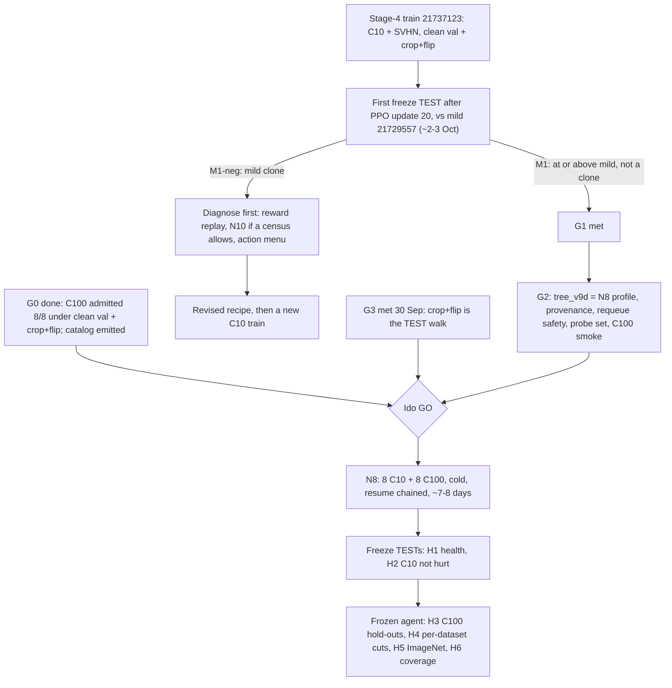

# N8 — the diverse train (CIFAR-10 + CIFAR-100): roadmap

Written 30 Sep 2026 ~12:00 IDT (Opus 5.5 sitting). **Status: not started; needs Ido's GO.** The catalog is emitted (ledger §148). Ops flags the milestones below (runbook `docs/OPS_HANDOFF_RUNBOOK.md` §10.4).

## 1. What N8 is

One cold DRL train of the SPECTRA agent on the admitted V7 catalog: 16 nets, 8 CIFAR-10 + 8 CIFAR-100, with ResNet, VGG, MobileNetV2 and DenseNet on both datasets. It uses the Stage-4 recipe unchanged. The one change against Stage 4 is the pool. It is NEON's offline multi-dataset training carried over to CNNs, and it makes the agent that Gilad wants frozen and tested on ImageNet, the dataset hold-out.

| | Stage 4 (21737123) | N8 |
|---|---|---|
| Catalog | P5-B2: 9 C10 + 1 SVHN | V7 admitted: 8 C10 + 8 C100 (`configs/database_offline_v7_diverse_admitted.json`) |
| Datasets | cifar-10, svhn | cifar-10, cifar-100 |
| Val / TEST | P: val and TEST are disjoint 5k halves of the test split; batch 256 | same |
| Walk fine-tune | Adam 1e-3, 12/4, crop+flip on CIFAR | same; crop+flip on both datasets |
| Reward, actions, PPO, governor | in-band linear, 5 actions, PPO 4×4, min 250 episodes / patience 150 | same |
| Probes (freeze selection) | r56-w6 + r20-w10 (both C10) | same two, plus one C100 net (proposal, §5 item 4) |
| Start | cold | cold |
| Length at the Stage-4 pace | ~6 days to episode ~200, then the chained resume | ~7–8 days, one resume chained from the start |

## 2. Why it can work now

- **C100 could not enter the pool before.** The 18–20 Sep gate admitted 0 of 8 C100 nets (§109). It read val from the training split the nets had memorized (§141).
- **Under clean val and crop+flip, all 8 admit** at the deepest 2-pass mild point, 0.65–0.70 params kept (§148). The recipe is the one the Stage-4 train uses, so no per-dataset recipe is needed.
- **The state can tell the datasets apart.** The architecture tokens include the classifier layer, whose width is 10 or 100. `SPECTRA_SPOOF_NUM_CLASSES` exists to test exactly that coordinate. So the agent can learn different cut rates for a C100 net and a C10 net of the same architecture.
- **Diversity is what made NEON generic.** NEON trained one agent over 28 datasets. SPECTRA's pools so far were one dataset, plus one SVHN net.

## 3. Milestones that trigger N8

All are required unless marked.

| Id | Milestone | Status (30 Sep 12:00) | How it is checked |
|---|---|---|---|
| **G0** | C100 recoverable under the train recipe; catalog emitted | **done** | §148: 8/8 admitted; 16-net catalog; `tests/test_v5_catalog.py` 16/16 |
| **G1** | The Stage-4 recipe leaves mild (runbook **M1**) | pending; first read ~2–3 Oct | The first freeze TEST after PPO update 20 against mild 21729557 at equal keep, plus the compression-rate census |
| **G2** | `tree_v9d` ready (§5) | not built | CPU pytest on the cluster conda; a 2-episode GPU smoke on C100 nets |
| **G3** | TEST-walk recipe settled (decision d) | **met 30 Sep 11:55** (§152: twins 2/3; thin r56-w4 +5.0 pp) | the 21730506 conversion is Ido's call |
| **G4** | One GPU for ~8 days | Stage 4 holds 1 of 4 | the no-agent ladder drains in ~2–3 days |
| **G5** | Ido's GO | — | — |

- **If speed matters more than risk** (Ido's call): start N8 in parallel once runbook **M2** (training health at PPO update 10) is green. The risk is that both trains copy mild for a week, on two of the four slots.
- **If G1 fails** (runbook **M1-neg**): N8 as specified is not promising. A more diverse pool does not fix a reward and recipe that collapse to mild. The next sitting diagnoses first: reward replay (O38), N10 if a census allows it, the action menu. N8 waits for a recipe that leaves mild on C10.

## 4. What N8 should show (pre-registered)

| Id | Hope | Read | Pass line |
|---|---|---|---|
| **H1** | It learns on a mixed pool | ev, `gap_to_uniform`, freezes (Stage-4 flags) | health by PPO update 10; a freeze by episode 120 |
| **H2** | Adding C100 does not hurt C10 | N8 freeze vs the Stage-4 freeze on the thin C10 pair, same TEST walk | no point more than 0.5 pp worse at equal keep |
| **H3** | At or above mild on held-out C100 nets | frozen N8 vs mild, P + crop+flip, on 6 nets: the C9 TEST set (`input_offline_c100.json`: thin r20-w16 and r56-w15, VGG-16, ShuffleNetV2, RepVGG-A0) and the VGG-19 twin. ShuffleNetV2 and RepVGG are families N8 never trains on | ≥ mild at equal keep on ≥ 4 of 6; not a mild clone |
| **H4** | A dataset-conditioned policy (a new SPECTRA insight) | `val_best` keep per dataset for the same architecture: VGG-11 / VGG-13 / ResNet-32 / MobileNetV2 / DenseNet-40 on C10 vs C100, deterministic walks | a consistent, sign-stable difference, e.g. C100 nets cut less |
| **H5** | The dataset hold-out Gilad asked for | frozen N8 → ImageNet (no ImageNet DRL train; ≥ `rtx_4090`) vs mild at equal keep | ≥ mild at equal keep |
| **H6** | Architecture transfer (coverage matrix) | the similar / unlike hold-out sets | ≥ mild on at least half the nets |

- **Report, never scancel,** as for Stage 4: ev ≤ 0 by update 10; no freeze by episode 250; a mild clone at the first freeze TEST.
- **N8 is not:** an ImageNet train; a C10-only → C100 transfer (never the intended cell, Ido 17 Sep); a claim to beat focused SOTA on its home cell.

## 5. `tree_v9d` work N8 needs (next sitting; ~2–3 h plus a 1 h GPU smoke)

1. **Profile `offline_train_v9_diverse`.** Pin the Stage-4 recipe inside the profile (P, batch 256, `SPECTRA_FT_AUG=1`, `SPECTRA_PROBE_SCORE=area`). Set `SPECTRA_DATABASE` to the admitted v7 catalog and `SPECTRA_DATASET_NAMES="cifar-10 cifar-100"`; the p5b2 profile hard-sets `cifar-10 svhn`. Run `build_v5_catalog.py --check-admitted` before training, as the p5b3 profile does.
2. **Provenance.** Add `SPECTRA_FT_AUG` and `SPECTRA_FT_AUTOAUG` to `POLICY_INFO_KEYS` (`src/A2C_Agent_Reinforce.py`); the P keys are already recorded there.
3. **Requeue safety.**
   - Add `--no-requeue` to train submits.
   - The prologue should copy a parent bundle only when the run dir has none: today a requeued resume would overwrite its own newer bundle with the parent's.
   - Fix the stale "the governor restarts" comment in `spectra.sbatch`.
4. **Probe set.**
   - *The choice.* Keep r56-w6 + r20-w10 (one change against Stage 4, clean attribution), or add one C100 net through `SPECTRA_PROBE_NETS` (e.g. `resnet20-width13_cifar100`).
   - *Recommendation.* Add the C100 probe. A selection score that sees only C10 would select a C10 policy. It costs one more probe walk every 12 episodes.
5. **Optional speed.** GPU-side crop+flip, up to the measured +18 % per epoch. Build it for N8's launch; never swap it into a live train.
6. **Tests.** CPU pytest, then a GPU smoke of 2 episodes on C100 nets. It checks the loader, val-from-test on cifar-100 during training, aug on, the standardizer over 16 nets, and the per-net step counts. Never ledger it.
7. **Launch.** Chain the resume at submit (`afterok`) and set `Requeue=0` on both jobs.

## 6. Timeline if G1 lands

Estimates at the measured Stage-4 pace (mean 2,315 s per episode over the first 12).

- ~2–3 Oct: the Stage-4 freeze TEST verdict (M1 or M1-neg).
- The next science sitting: `tree_v9d` build and smoke, about half a day.
- ~3–4 Oct: N8 launch on Ido's GO, resume chained.
- ~7–8 Oct: N8's first freeze TEST after PPO update 20 (H1, H2).
- ~11–13 Oct: N8 stops (governor or resume fuse). Then ~3 days of hold-out TESTs: C100 (H3), per-dataset keep (H4), ImageNet (H5), coverage (H6).
- The Stage-4 train runs in parallel to its own stop, ~7–12 Oct.

