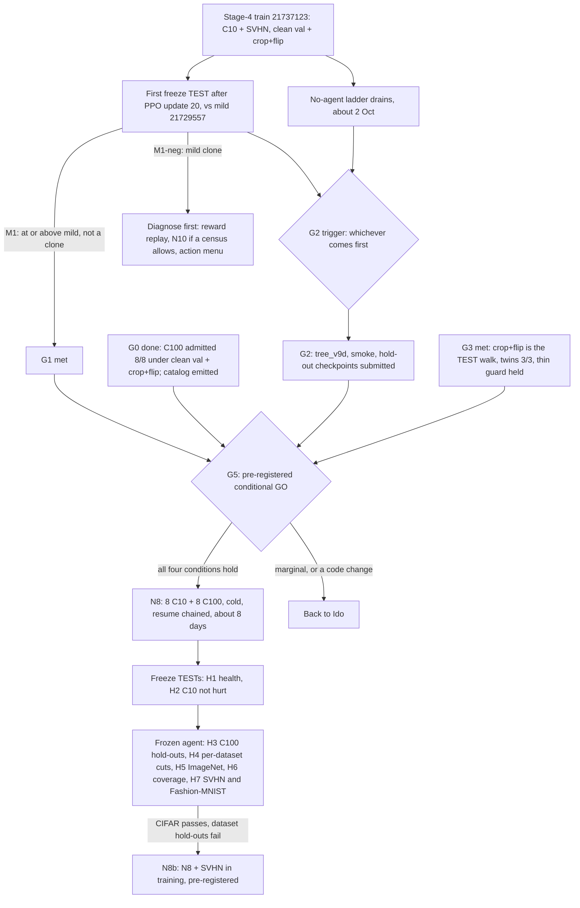

# N8 — the diverse train (CIFAR-10 + CIFAR-100): roadmap

Written 30 Sep 2026 ~12:00 IDT. §2b, the G2 trigger, the G5 proposal and H7 were added at ~13:20, answering Ido's questions of 12:34 (Opus 5.5 sitting). **Status: not started.** The catalog is emitted (ledger §148). Ops flags the milestones below (runbook `docs/OPS_HANDOFF_RUNBOOK.md` §10.4).

## 1. What N8 is

One cold DRL train of the SPECTRA agent on the admitted V7 catalog: 16 nets, 8 CIFAR-10 + 8 CIFAR-100, with ResNet, VGG, MobileNetV2 and DenseNet on both datasets. It uses the Stage-4 recipe unchanged. The one change against Stage 4 is the pool. It is NEON's offline multi-dataset training carried over to CNNs, and it makes the agent that Gilad wants frozen and tested on ImageNet, the dataset hold-out.

| | Stage 4 (21737123) | N8 |
|---|---|---|
| Catalog | P5-B2: 9 C10 + 1 SVHN | V7 admitted: 8 C10 + 8 C100 (`configs/database_offline_v7_diverse_admitted.json`) |
| Datasets | cifar-10, svhn | cifar-10, cifar-100 |
| Val / TEST | P: val and TEST are disjoint 5k halves of the test split; batch 256 | same |
| Walk fine-tune | Adam 1e-3, 12/4, crop+flip on CIFAR | same; crop+flip on both datasets |
| Reward, actions, PPO, governor | in-band linear, 5 actions, PPO 4×4, min 250 episodes / patience 150 | same |
| Probes (freeze selection) | r56-w6 + r20-w10 (both C10) | same two, plus one C100 net (proposal, §5 item 4) |
| Start | cold | cold |
| Length at the Stage-4 pace | ~6 days to episode ~200, then the chained resume | ~7–8 days, one resume chained from the start |

## 2. Why it can work now

- **C100 could not enter the pool before.** The 18–20 Sep gate admitted 0 of 8 C100 nets (§109). It read val from the training split the nets had memorized (§141).
- **Under clean val and crop+flip, all 8 admit** at the deepest 2-pass mild point, 0.65–0.70 params kept (§148). The recipe is the one the Stage-4 train uses, so no per-dataset recipe is needed.
- **The state can tell the datasets apart.** The architecture tokens include the classifier layer, whose width is 10 or 100. `SPECTRA_SPOOF_NUM_CLASSES` exists to test exactly that coordinate. So the agent can learn different cut rates for a C100 net and a C10 net of the same architecture.
- **Diversity is what made NEON generic.** NEON cross-validated over 28 datasets: five agents, each trained on four of five dataset folds (~22 datasets, 30 random networks each) and tested on the fifth. SPECTRA's pools so far had CIFAR-10 plus at most four nets from other datasets.

## 2b. The catalog choice: two datasets in, three held out (Ido, 30 Sep 12:34)

**History.** The August 10-net agents (s42 / s43 / s44) trained on CIFAR-10 plus SVHN and Fashion-MNIST, two nets each (r20-w16 and VGG-11: the whole zoo on those datasets), and never saw CIFAR-100. V7 (21 Sep) reversed this. CIFAR-100 went into the pool, as Gilad asked (C100 belongs in the train pool; ImageNet is the dataset hold-out). SVHN and Fashion-MNIST became the two cheap dataset hold-outs. Stage 4 still has VGG-11 SVHN in its pool.

**Were the architectures considered? Yes: the catalog is a family × dataset grid** (`docs/V7_TRAIN_CATALOG.md`).

- *Training families.* Five families on both datasets: thin ResNet (two widths), ResNet-32, VGG-BN (11, 13), MobileNetV2 (×0.5, ×1) and DenseNet-40. At most two exemplars per family × dataset cell. ResNets are 6 of 16, under the 40 % cap. Origins are 91.9–94.0 % on C10 and 70.0–74.6 % on C100.
- *Why a grid.* It answers the 24-net failure. There, 12 of 24 nets were near-duplicate thin ResNets, and the agent became a ResNet-width specialist (ledger §17).
- *Benchmark exclusions.* Benchmark architectures are excluded by architecture, not only by weights: no standard-width ResNet-56, no VGG-16 on C10, no VGG-19.
- *Hold-outs, defined against the training families:*
  - *similar:* the same families at other widths or depths (r20-w16, r56-w10, ResNet-44, VGG-19, MobileNetV2 ×0.75, DenseNet-100);
  - *unlike:* families never trained on (ShuffleNetV2 ×1 / ×1.5, RepVGG-A0 / A1);
  - *thin:* r20-w2 and r56-w4, narrower than any net in the pool;
  - *C100 residuals:* r20-w16 and r56-w15, wider than any net in the pool;
  - *ImageNet:* ResNet-50 has bottleneck blocks, which no training net has.
- *Enforcement.* `tests/test_v5_catalog.py` fails if a training file and a TEST file share a net.
- *Gaps.* The SVHN and Fashion-MNIST rows hold only seen families (addition 1 below). There is no EfficientNet, RegNet or ConvNeXt anywhere; that is out of scope for N8.

**Four designs, against the headline claims.** The claims: train once on many architectures and datasets; apply frozen to unseen nets and datasets; be competitive enough while transferring.

| Design | Train on | Held out | For | Against |
|---|---|---|---|---|
| **A: N8 as emitted** | C10, C100 | SVHN, Fashion-MNIST, ImageNet | Three held-out datasets, three kinds of shift. The pool is balanced, so H4 can be read. C100's accuracy regime matches ImageNet's. One aug recipe; what Gilad was told | Both training datasets are CIFAR. The state is data-dependent, so every held-out dataset is off-distribution. The SVHN and Fashion-MNIST rows have 2 nets each. One split |
| B | + SVHN | Fashion-MNIST, ImageNet | A second image domain in training. Stage 4 already mixes SVHN | 2 SVHN nets against 16 CIFAR nets: a lopsided pool. Loses the cleanest held-out dataset. SVHN takes no flip, so it needs its own aug rule. The dataset claim then rests on Fashion-MNIST (2 nets) and ImageNet |
| C | + SVHN + Fashion-MNIST | ImageNet | The most diverse pool: the August pool plus C100 | One held-out dataset, the most expensive to TEST, 5 nets. "Transfers to unseen datasets" becomes "transfers to ImageNet" |
| D: NEON rotation | leave one of {C10, C100, SVHN, F-MNIST} out | each in turn, plus ImageNet | NEON's own protocol: every dataset is held out once | Four ~8-day trains: a month of one slot, or all four slots for 8 days. Its SVHN and Fashion-MNIST folds have 2 nets. Not affordable before one diverse train has worked |

Notes on the table:
- *A's three shifts.* Domain: house-number digits (SVHN). Modality: grayscale clothing, 28 px upsampled (Fashion-MNIST). Scale: 224 px and 1000 classes (ImageNet).
- *A's regime argument.* C100 origins are 70–75 %, against 69–76 % for the ImageNet zoo. SVHN and Fashion-MNIST (94–97 %) repeat C10's easy regime.
- *A's main risk.* Both training datasets have near-identical image statistics, against NEON's ~22 datasets per agent. The state includes per-layer activation moments over the dataset's own images, so a held-out dataset is off-distribution for both the encoder and the standardizer.

**Recommendation: keep A for N8.**
- *Why.* N8's purpose is to test transfer. A holds out the most datasets, and the most varied ones.
- *Why it also helps H2.* It keeps the training-side change against Stage 4 small: add C100.
- *The cost is real.* A CIFAR-only pool may not transfer to digits, grayscale or 224-px statistics. If it fails there, the result will not say whether the cause is the shift or the narrow pool.

Three additions address that:

1. **Grow the SVHN and Fashion-MNIST hold-out rows** from 2 nets of seen families to ~6 each.
   - *Nets:* ShuffleNetV2 ×1 and RepVGG-A0, which put unseen families on an unseen dataset (the strongest cell of the coverage matrix), plus MobileNetV2 ×0.5 and DenseNet-40 (seen families).
   - *How:* `scripts/train_pretrained_checkpoint.py` already takes `--dataset svhn` and `fashion-mnist`; 200 epochs, ~1–3 GPU-h per net.
   - *Where:* hold-out input files only; the disjointness test covers them.
   - *When:* the G2 sitting submits them, so they exist before N8's hold-out TESTs (~11 Oct).
   - *Also for Stage 4:* they serve the Stage-4 agent's coverage TEST. Fashion-MNIST is clean for it; SVHN is not, because VGG-11 SVHN is in its pool.
2. **Caption H2 honestly.** N8's pool differs from Stage 4's in three ways: +8 C100 nets, −r20-w8 C10 and −VGG-11 SVHN. H2 reads the net effect of all three, not "adding C100".
3. **Pre-register N8b:** N8 plus the SVHN nets as a third training dataset, everything else the same.
   - *Trigger.* N8 passes on CIFAR (H2, H3) but is below mild on the dataset hold-outs (H5, H7).
   - *Read.* Compare N8 and N8b on the hold-outs that neither trains on: Fashion-MNIST, ImageNet and the unlike families.
   - *Outcomes.* If N8b fixes them, dataset diversity in training drives dataset transfer: NEON's lesson, measured on CNNs. If N8 already passes, N8b is not needed.

A cheap diagnostic for H4 and H5: rerun one ImageNet TEST with `SPECTRA_SPOOF_NUM_CLASSES=100`. If the cuts move, the policy uses the class count as its dataset cue.

## 3. Milestones that trigger N8

All are required.

| Id | Milestone | Status (30 Sep 13:20) | How it is checked |
|---|---|---|---|
| **G0** | C100 recoverable under the train recipe; catalog emitted | **done** | §148: 8/8 admitted; 16-net catalog; `tests/test_v5_catalog.py` 16/16 |
| **G1** | The Stage-4 recipe leaves mild (runbook **M1**) | pending | The first freeze TEST after PPO update 20 against mild 21729557 at equal keep, plus the compression-rate census |
| **G2** | `tree_v9d` ready (§5) | not built; trigger below | CPU pytest on the cluster conda; a 2-episode GPU smoke on C100 nets |
| **G3** | TEST-walk recipe settled (decision d) | **met** 30 Sep 11:55; twins 3/3 at 12:50 (§152) | 21730506 converted to **21809595** (Ido GO 12:34) |
| **G4** | One GPU for ~8 days | Stage 4 holds 1 of 4 | the no-agent ladder drains ~2 Oct |
| **G5** | Ido's GO | proposal below | — |

**G1 timing** at the current pace (12 episodes in 9.5 h, ~0.79 h each):
- PPO update 10 (runbook M2): ~1 Oct 11:00.
- Episode 80 (update 20): ~2 Oct 18:30.
- The first probe after update 20: episode 84, ~2 Oct 22:00. A freeze needs a new best probe score.
- The fallback: episode 120, ~3 Oct 23:30.
- The freeze at episode 11 (30 Sep 12:44, after update 3) is not a TEST (runbook §10.3 item 1).

**The G2 trigger.** Ops pings "G2 TRIGGER" at the first of:
- (a) ops submits the first M1 freeze TEST (the first freeze after update 20, or the episode-120 fallback);
- (b) the no-agent ladder has drained: two QOS slots free and nothing PD to fill them.

At the current pace (b) comes first, ~2 Oct. Ido opens a science sitting on the ping.
- *Why before M1.* Most of `tree_v9d` does not depend on the recipe: requeue safety, provenance, the probe set, GPU aug, the tests. Any next train needs it, N8 or not. Only the profile's recipe pin waits for M1. Building after M1 would leave an N8-ready slot idle for about half a day.
- *Why not now.* Nothing in it can run before a slot frees. The sitting should also have M2 in hand.
- *If M2 is red,* the sitting builds only the generic items and holds the N8 profile.
- *Same sitting:* it also submits the hold-out checkpoints (§2b addition 1) on the slots the ladder frees.

**G5, exactly.** G5 is Ido's explicit GO to launch N8. It exists because a DRL train holds one of four GPUs for ~8 days, and its frozen agent becomes the thesis's transfer result. Until now it had no written conditions. **Proposal: pre-register it now as a conditional GO,** so the decision is fixed before the M1 numbers are seen.

- *GO; the science sitting launches* when all four hold:
  1. M1 as written in runbook §10.4, on both thin nets, and not a mild clone.
  2. The `tree_v9d` smoke passes, with no code change after it.
  3. The catalog is A, with additions 1 and 2 (§2b).
  4. A slot is free without touching the Stage-4 train or its resume.
- *Back to Ido* when any of these holds:
  - M1 passes by less than 1.5 pp everywhere it passes (about twice the 0.8 pp cross-card re-walk noise, §149);
  - the census is borderline (a 0.9 rate on 85–95 % of legal rows);
  - the smoke needs a code change;
  - M1-neg.
- *Never ops.* Ops flags G1 and the G2 trigger; it never launches N8. Ido tells Gilad at launch; that is not a gate.

**Other routes.**
- **If speed matters more than risk** (Ido's call): start N8 in parallel once runbook **M2** (training health at PPO update 10) is green. The risk is that both trains copy mild for a week, on two of the four slots.
- **If G1 fails** (runbook **M1-neg**): N8 as specified is not promising. A more diverse pool does not fix a reward and recipe that collapse to mild. The next sitting diagnoses first: reward replay (O38), N10 if a census allows it, the action menu. N8 waits for a recipe that leaves mild on C10.

## 4. What N8 should show (pre-registered)

| Id | Hope | Read | Pass line |
|---|---|---|---|
| **H1** | It learns on a mixed pool | ev, `gap_to_uniform`, freezes (Stage-4 flags) | health by PPO update 10; a freeze by episode 120 |
| **H2** | The new pool does not hurt C10 | N8 freeze vs the Stage-4 freeze on the thin C10 pair, same TEST walk. Captioned as the net effect of +C100, −r20-w8, −VGG-11 SVHN (§2b) | no point more than 0.5 pp worse at equal keep |
| **H3** | At or above mild on held-out C100 nets | frozen N8 vs mild, P + crop+flip, on 6 nets: the C9 TEST set (`input_offline_c100.json`: thin r20-w16 and r56-w15, VGG-16, ShuffleNetV2, RepVGG-A0) and the VGG-19 twin. ShuffleNetV2 and RepVGG are families N8 never trains on | ≥ mild at equal keep on ≥ 4 of 6; not a mild clone |
| **H4** | A dataset-conditioned policy (a new SPECTRA insight) | `val_best` keep per dataset for the same architecture: VGG-11 / VGG-13 / ResNet-32 / MobileNetV2 / DenseNet-40 on C10 vs C100, deterministic walks | a consistent, sign-stable difference, e.g. C100 nets cut less |
| **H5** | The dataset hold-out Gilad asked for | frozen N8 → ImageNet (no ImageNet DRL train; ≥ `rtx_4090`) vs mild at equal keep | ≥ mild at equal keep |
| **H6** | Architecture transfer (coverage matrix) | the similar / unlike hold-out sets | ≥ mild on at least half the nets |
| **H7** | Transfer to the cheap held-out datasets | frozen N8 vs mild on SVHN and Fashion-MNIST, ~6 nets each after §2b addition 1; the train's TEST walk (crop+flip applies to CIFAR only) | ≥ mild at equal keep on at least half the nets of each dataset |

- **Report, never scancel,** as for Stage 4: ev ≤ 0 by update 10; no freeze by episode 250; a mild clone at the first freeze TEST.
- **N8 is not:** an ImageNet train; a C10-only → C100 transfer (never the intended cell, Ido 17 Sep); a claim to beat focused SOTA on its home cell.

## 5. `tree_v9d` work N8 needs (the G2 sitting; ~2–3 h plus a 1 h GPU smoke)

1. **Profile `offline_train_v9_diverse`.** Pin the Stage-4 recipe inside the profile (P, batch 256, `SPECTRA_FT_AUG=1`, `SPECTRA_PROBE_SCORE=area`). Set `SPECTRA_DATABASE` to the admitted v7 catalog and `SPECTRA_DATASET_NAMES="cifar-10 cifar-100"`; the p5b2 profile hard-sets `cifar-10 svhn`. Run `build_v5_catalog.py --check-admitted` before training, as the p5b3 profile does.
2. **Provenance.** Add `SPECTRA_FT_AUG` and `SPECTRA_FT_AUTOAUG` to `POLICY_INFO_KEYS` (`src/A2C_Agent_Reinforce.py`); the P keys are already recorded there.
3. **Requeue safety.**
   - Add `--no-requeue` to train submits.
   - The prologue should copy a parent bundle only when the run dir has none: today a requeued resume would overwrite its own newer bundle with the parent's.
   - Fix the stale "the governor restarts" comment in `spectra.sbatch`.
4. **Probe set.**
   - *The choice.* Keep r56-w6 + r20-w10 (one change against Stage 4, clean attribution), or add one C100 net through `SPECTRA_PROBE_NETS` (e.g. `resnet20-width13_cifar100`).
   - *Recommendation.* Add the C100 probe. A selection score that sees only C10 would select a C10 policy. It costs one more probe walk every 12 episodes.
5. **Optional speed.** GPU-side crop+flip, up to the measured +18 % per epoch. Build it for N8's launch; never swap it into a live train.
6. **Tests.** CPU pytest, then a GPU smoke of 2 episodes on C100 nets. It checks the loader, val-from-test on cifar-100 during training, aug on, the standardizer over 16 nets, and the per-net step counts. Never ledger it.
7. **Launch.** Chain the resume at submit (`afterok`) and set `Requeue=0` on both jobs.
8. **Hold-out checkpoints** (§2b addition 1). ShuffleNetV2 ×1, RepVGG-A0, MobileNetV2 ×0.5 and DenseNet-40 on SVHN and on Fashion-MNIST, with `train_pretrained_checkpoint.py`, 200 epochs. Add them to hold-out input files and extend the disjointness test.
9. **Catalog L size points.**
   - *The error.* The `eval_size_match` docstring in `src/fortify.py` (and older docs) says "OCS VGG-16 ≈ 0.42 params". That is OCSPruner's ResNet-56 point.
   - *The published VGG-16 C10 sizes:* HRank 46.5 % FLOPs / 17.1 % params kept; OCSPruner (pretrained start) 21.2 % FLOPs / 13.7 % params.
   - *The fix.* Mild keeps params ≈ FLOPs, so the size match is on FLOPs. The frozen agent's Catalog L TEST uses R56 `flop:0.47,0.39` and VGG-16 `flop:0.465,0.212`, with enough passes to reach them. Mild needs 10 passes on VGG-16 (**21814029**).

## 6. Timeline if G1 lands

Estimates at the measured Stage-4 pace (~0.79 h per episode over the first 12, probes included).

- ~1 Oct 11:00: M2 (PPO update 10).
- ~2 Oct: the ladder drains, which is G2 trigger (b). The sitting builds `tree_v9d`, runs the smoke, and submits the hold-out checkpoints.
- ~2 Oct 22:00 to ~3 Oct 23:30: the first M1 freeze TEST (episodes 84–120). The verdict comes ~5 h later.
- With G5 pre-registered: N8 launches on the next free slot the same day, resume chained.
- ~3 days after launch: N8's first freeze TEST after PPO update 20 (H1, H2).
- ~8 days after launch (~11–13 Oct): N8 stops. Then ~3 days of hold-out TESTs, H3–H7.
- The Stage-4 train runs to its own stop, ~7–12 Oct.

